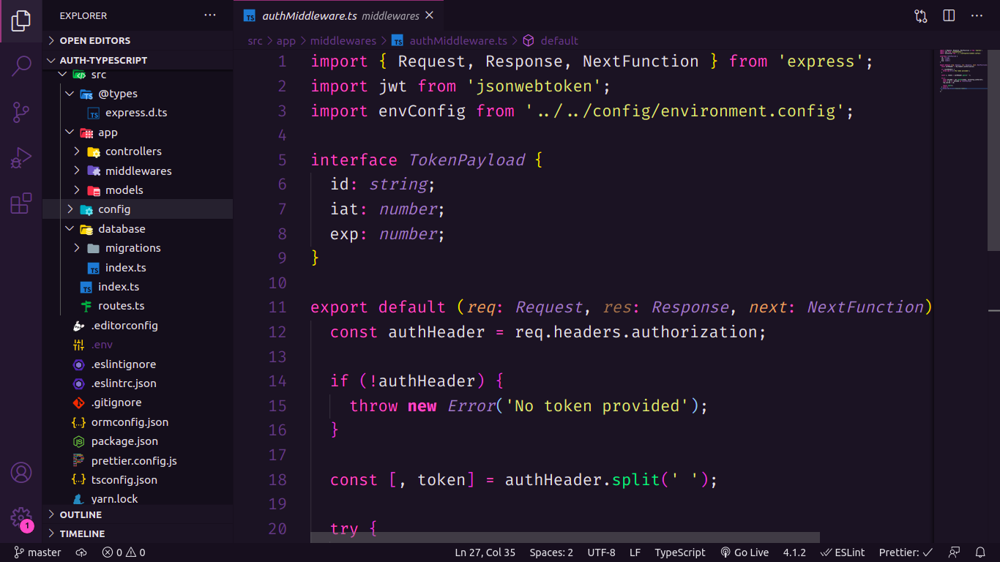

<p align="center">
  <h3 align="center">Jwt authentication with Typescript</h3>

  <p align="center">
    An api that authenticates users using JWT!
    <br />
    <a href="https://github.com/LucFerSan/authentication-jwt-typescript"><strong>Explore the docs »</strong></a>
    <br />
    <br />
    ·
    <a href="https://github.com/LucFerSan/authentication-jwt-typescript/issues">Report Bug</a>
    ·
    <a href="https://github.com/LucFerSan/authentication-jwt-typescript/issues">Request Feature</a>
  </p>
</p>

## About The Project



I wanted to get a little further with authentication since my last project was simpler, that's why I decided to work with typescript and add Postgres to work with databases.

In this project, I decided to use typeorm, which I found fantastic, because of its simple way to configure, and also because it has a lot of power when combined with typescript.

I also worked with environment variables, which are a more secure way of storing API secrets.

And to give the code a pattern, I worked with eslint, prettier, and editor config.

I've used docker to create the containers for the database.

### Built With

- [Typescript](https://www.typescriptlang.org/)
- [JsonWebToken](https://www.npmjs.com/package/jsonwebtoken)
- [Bcrypt](https://www.npmjs.com/package/bcrypt)
- [Express](https://www.npmjs.com/package/express)
- [Eslint](https://eslint.org/)
- [Prettier](https://prettier.io/)
- [Dotenv](https://www.npmjs.com/package/dotenv)
- [Typeorm](https://typeorm.io/#/)

### Installation

1. Clone the repo
   ```sh
   git clone https://github.com/LucFerSan/authentication-jwt-typescript
   ```
2. Install NPM packages
   ```sh
   yarn
   ```
3. Create a docker container
   ```sh
   docker run --name jwtauth -e POSTGRES_PASSWORD=docker -p 5432:5432 -d postgres
   ```
4. Create database named jwtauth
   ```sh
   docker run --name jwtauth -e POSTGRES_PASSWORD=docker -p 5432:5432 -d postgres
   ```

## Contributing

Contributions are what make the open source community such an amazing place to be learn, inspire, and create. Any contributions you make are **greatly appreciated**.

1. Fork the Project
2. Create your Feature Branch (`git checkout -b feature/AmazingFeature`)
3. Commit your Changes (`git commit -m 'Add some AmazingFeature'`)
4. Push to the Branch (`git push origin feature/AmazingFeature`)
5. Open a Pull Request

## License

Distributed under the MIT License. See `LICENSE` for more information.

## Contact

Lucas Fernandes - fernandes.lucas11@outlook.com

Project Link: [https://github.com/LucFerSan/authentication-jwt-typescript](https://github.com/LucFerSan/authentication-jwt-typescript)
